# 模拟GPS信号的发送和接收（TCP通信）

## 一、课程设计目的及意义

本课程设计是为配合《嵌入式软件设计》课程的学习而设立的，通过本课程设计，可使学生更加深刻地理解《嵌入式软件设计》课程讲述的内容；培养学生独立思考、解决实际工程问题的能力；提高学生设计、实现、调试、测试嵌入式软件的能力。

## 二、设计任务

1. 通过程序（Client进程）模拟每隔一秒钟发出一帧NMEA-0183格式的标准GPS信号，对GPS信号进行一定的处理后发送给另一个进程（Server）。Server通过IPC（进程间通信）获得Client发出的信号，进行解析，并把解析出的相关信息进行存储和处理后输出。

```textile
GPS固定输出数据语句格式： 
$GPGGA,<1>,<2>,<3>,<4>,<5>,<6>,<7>,<8>,<9>,M,<10>,M,<11>,<12>*hh 

举例：
$GPGGA,115542.000,3155.3446,N,11852.4283,E,1,03,4.4,32.6,M,5.4,M,,0000*5A  <1>

<1> UTC 时间，hhmmss（时分秒）格式  
<2> 纬度ddmm.mmmm（度分）格式（前面的0 也将被传输）  
<3> 纬度半球N（北半球）或S（南半球）  
<4> 经度dddmm.mmmm（度分）格式（前面的0 也将被传输）   
<5> 经度半球E（东经）或W（西经）  
<6> GPS 状态：0=未定位，1=非差分定位，2=差分定位，6=正在估算  
<7> 正在使用解算位置的卫星数量（00-12）（前面的0 也将被传输）  
<8> HDOP水平精度因子（0.5-99.9）  
<9> 海拔高度（-9999.9-99999.9）  
<10> 地球椭球面相对大地水准面的高度  
<11> 差分时间（从最近一次接收到差分信号开始的秒数，如果不是差分定位将为空）  
<12> 差分站ID 号0000-1023（前面的0 也将被传输，如果不是差分定位将为空）
```

2. Client每隔1s输出一帧GPS信息。

3. Server接收到GPS帧后，解码，把相关信息实时存入一个文件，并把解析出的数据以“名称：值”的方式在标准输出输出。

4. Client和Server两者，一方运行在PC上（Linux或者Windows均可），一方运行在开发板，使用TCP进行通信。

5. 如果能移植编译sqlite数据库，并把数据存储在sqllite数据库中，加分项。

## 三、主要技术指标和要求

1. 系统结构
- Client-Server架构：Client进程模拟GPS信号的生成并通过TCP/IP协议发送到Server进程，Server进程接收并处理这些信号。

- 通信协议：TCP/IP。
2. GPS信号生成 (Client)
- NMEA-0183格式：生成的GPS信号符合NMEA-0183标准，具体为GPGGA语句。

- 信号生成频率：每秒钟生成一帧GPS信号。

- 信号格式示例：

```textile
$GPGGA,115542.000,3155.3446,N,11852.4283,E,1,03,4.4,32.6,M,5.4,M,,0000*5A
```

3. 数据解析 (Server)
- 数据接收：通过TCP/IP接收Client发来的GPS信号。

- 数据解析：解析NMEA-0183格式的GPGGA语句，提取各个字段的信息。

- 信息存储：将解析后的信息存储在文件中。
4. 数据持久化 (可选加分项)
- SQLite数据库：将解析后的数据存储到SQLite数据库中。
5. 运行环境
- 开发平台：
  
  - 一方运行在PC（Linux或Windows均可）。
  
  - 另一方运行在开发板（实验环境为ARM处理器，搭载ubuntu系统）。
6. 通信细节
- 端口选择：固定的TCP端口用于通信。

- 连接稳定性：需考虑网络不稳定情况下的重连机制。
7. 编程语言与工具
- 编程语言：C。

- 开发工具：GCC、VS Code、git、SQLite库等。
8. 测试与验证
- 测试环境：需要在PC和开发板之间进行通信测试，验证数据传输的稳定性和正确性。

- 功能验证：Client每秒发送一帧GPS信号；Server正确接收并解析信号，将信息存储并输出。

## 四、设计流程及设计思想说明

1. 框图

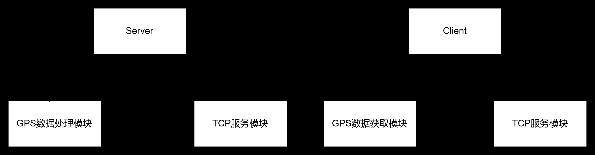

- Server端由TCP服务模块、GPS数据处理模块组成。

- Client端由GPS数据获取模块、TCP服务模块组成。

TCP服务模块，用来进行TCP通信，传输GPS数据的字符串。选取端口为56789 。

GPS数据获取模块，通过GPS相关硬件获取相关GPS数据，组合成NMEA-0183格式的GPGGA语句并通过TCP服务模块传输到Server文件中。

GPS数据处理模块，用来对接收到的NMEA-0183格式的GPGGA语句进行处理，并以名称：值的形式显示出来，并存入到文件或数据库中。

2．子模块设计

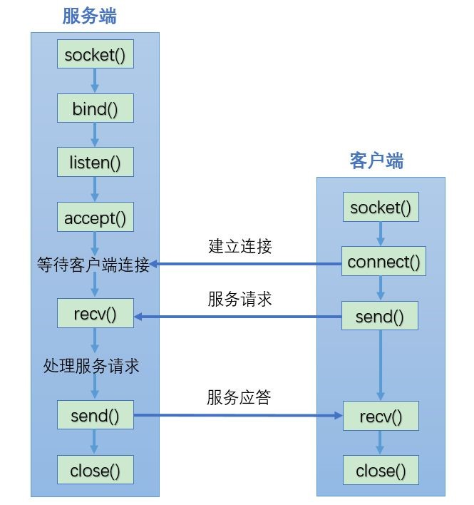

- TCP服务模块的工作流程如上图所示，通过使用套接字Socket库来使用TCP协议进行通信，对于服务端和客户端，都需要进行套接字的初始化工作，并设置相关信息，服务端需要设置端口号、传输方式、允许接收的IP地址等，客户端需要设置需要连接的服务端的IP地址和端口号。接着建立连接后，就可以进行消息的收发。

- GPS数据获取模块，通过模拟GPS获取机制，得到一个NMEA-0183格式的GPGGA语句。

- GPS数据处理模块，根据NMEA-0183格式的GPGGA语句，将接收到的字符转化为名称：值的形式，并通过与数据库连接，将数据存入到sqlite中。

## 五、程序清单

- Server.c

```c
#include <stdio.h>
#include <stdlib.h>
#include <string.h>
#include <sys/socket.h>
#include <netinet/in.h>
#include <sqlite3.h>

#define DEFAULT_IP "192.168.86.129"// 服务器ip
#define DEFAULT_PORT 56789 // 服务器监听端口
#define buffer_len 124     //缓存区大小

typedef struct {
    char gpgga_head[7];               //GPGGA头部段
    char utc_time[7];                 //时间，hhmmss（时分秒）格式
    char latitude[10];                //纬度，ddmm.mmmm（度分）格式（前面的0 也将被传输）
    char latitude_hemisphere;         //N或S，表示维度半球
    char longitude[11];               //经度，dddmm.mmmm（度分）格式（前面的0 也将被传输）
    char longitude_hemisphere;        //E或W，表示经度半球
    int gps_status;                   //GPS 状态，0=未定位，1=非差分定位，2=差分定位，6=正在估算 
    char satellites_used[3];          //正在使用解算位置的卫星数量（00-12）（前面的0 也将被传输）
    float hdop;                       //HDOP水平精度因子（0.5-99.9）
    float altitude;                   //海拔高度（-9999.9-99999.9）
    float geoid_height;               //地球椭球面相对大地水准面的高度
    float differential_time;          //差分时间（从最近一次接收到差分信号开始的秒数，如果不是差分定位将为空）
    char differential_station_id[5];  //差分站ID 号0000-1023（前面的0 也将被传输，如果不是差分定位将为空）
    int hash;                         //校验和
} GPGGAData;

void parseGPGGA(char *buffer,GPGGAData *gpgga){
    char *temp,*s;
    char copy[buffer_len];
    strcpy(copy, buffer);
    s = copy;

    // 使用逗号作为分隔符
    temp = strsep(&s, ",");
    if (temp == NULL) return;
    strncpy(gpgga->gpgga_head, temp, 6);
    gpgga->gpgga_head[6] = '\0';

    temp = strsep(&s, ",");
    if (temp == NULL) return;
    strncpy(gpgga->utc_time, temp, 6);
    gpgga->utc_time[6] = '\0';

    temp = strsep(&s, ",");
    if (temp == NULL) return;
    strncpy(gpgga->latitude, temp, 9);
    gpgga->latitude[9] = '\0';

    temp = strsep(&s, ",");
    if (temp == NULL) return;
    gpgga->latitude_hemisphere = temp[0];

    temp = strsep(&s, ",");
    if (temp == NULL) return;
    strncpy(gpgga->longitude, temp, 10);
    gpgga->longitude[10] = '\0';

    temp = strsep(&s, ",");
    if (temp == NULL) return;
    gpgga->longitude_hemisphere = temp[0];

    //<6>
    temp = strsep(&s, ",");
    if (temp == NULL) return;
    gpgga->gps_status = atoi(temp);

    //<7>
    temp = strsep(&s, ",");
    if (temp == NULL) return;
    strncpy(gpgga->satellites_used, temp, 10);
    gpgga->satellites_used[2] = '\0';

    //<8>
    temp = strsep(&s, ",");
    if (temp == NULL) return;
    gpgga->hdop = atof(temp);

    //<9>
    temp = strsep(&s, ",");
    if (temp == NULL) return;
    gpgga->altitude = atof(temp);

    //M
    temp = strsep(&s, ",");
    if (temp == NULL) return;

    //<10>
    temp = strsep(&s, ",");
    if (temp == NULL) return;
    gpgga->geoid_height = atof(temp);

    //M
    temp = strsep(&s, ",");
    if (temp == NULL) return;

    //<11>
    temp = strsep(&s, ",");
    if (temp == NULL) return;
    if (strlen(temp) == 0)
        gpgga->differential_time = -1;
    else
        gpgga->differential_time = atof(temp);

    //<12>
    temp = strsep(&s, "*");
    if (temp == NULL) return;
    strncpy(gpgga->differential_station_id, temp, 4);
    gpgga->differential_station_id[4] = '\0';

    //校验和
    gpgga->hash = strtol(copy,&temp,16);
}

void printGPGGA(GPGGAData *gpgga){
    printf("\n------------------------------\n");
    printf("时间：%s\n",gpgga->utc_time);
    printf("纬度：%s\n",gpgga->latitude);
    printf("纬度半球：%c\n",gpgga->latitude_hemisphere);
    printf("经度：%s\n",gpgga->longitude);
    printf("经度半球：%c\n",gpgga->longitude_hemisphere);
    printf("GPS 状态：%d\n",gpgga->gps_status);
    printf("使用的卫星数量：%s\n",gpgga->satellites_used);
    printf("HDOP 水平精度因子：%f\n",gpgga->hdop);
    printf("海拔高度：%.1lf\n",gpgga->altitude);
    printf("地球椭球面相对大地水准面的高度：%f\n",gpgga->geoid_height);
    printf("差分时间：%f\n",gpgga->differential_time);
    printf("差分站ID：%s\n",gpgga->differential_station_id);
    printf("------------------------------\n");
}

int main() {
    int valread;
    char buffer[buffer_len] = {0};
    char *data;
    GPGGAData gpgga;

    // 打开数据库连接
    sqlite3 *db;
    int rc = sqlite3_open_v2("gps_data.db", &db, SQLITE_OPEN_READWRITE | SQLITE_OPEN_CREATE, NULL);
    if (rc != SQLITE_OK) {
        fprintf(stderr, "无法打开数据库: %s\n", sqlite3_errmsg(db));
        sqlite3_close(db);
        exit(EXIT_FAILURE);
    }

    // 创建表格
    const char *createTableSQL = "CREATE TABLE IF NOT EXISTS gps_data ("
                                 "id INTEGER PRIMARY KEY AUTOINCREMENT,"
                                 "utc_time TEXT,"
                                 "latitude TEXT,"
                                 "latitude_hemisphere TEXT,"
                                 "longitude TEXT,"
                                 "longitude_hemisphere TEXT,"
                                 "gps_status INTEGER,"
                                 "satellites_used TEXT,"
                                 "hdop REAL,"
                                 "altitude REAL,"
                                 "geoid_height REAL,"
                                 "differential_time REAL,"
                                 "differential_station_id TEXT"
                                 ");";

    rc = sqlite3_exec(db, createTableSQL, 0, 0, 0);
    if (rc != SQLITE_OK) {
        fprintf(stderr, "无法创建表格: %s\n", sqlite3_errmsg(db));
        sqlite3_close(db);
        exit(EXIT_FAILURE);
    }


    // 创建套接字
    int server_socket = socket(AF_INET, SOCK_STREAM, 0);
    if (server_socket == -1) {
        perror("Socket creation failed");
        exit(EXIT_FAILURE);
    }

    //设置服务端信息
    struct sockaddr_in server_addr;
    memset(&server_addr, 0, sizeof(server_addr));
    server_addr.sin_family = AF_INET;
    server_addr.sin_port = htons(DEFAULT_PORT);
    server_addr.sin_addr.s_addr = INADDR_ANY;   //接收任意地址

    // 绑定套接字到指定的端口
    if (bind(server_socket, (struct sockaddr *)&server_addr, sizeof(server_addr)) < 0) {
        perror("Bind failed");
        exit(EXIT_FAILURE);
    }

    // 开始监听连接
    if (listen(server_socket, 3) < 0) {
        perror("Listen failed");
        exit(EXIT_FAILURE);
    }

    printf("Server listening on port 56789...\n");

    // 接受客户端连接请求,创建客户端套接字
    struct sockaddr_in client_addr;
    socklen_t client_addr_len = sizeof(client_addr);
    int client_socket = accept(server_socket, (struct sockaddr *)&client_addr, &client_addr_len);
    if (client_socket == -1) {
        perror("accept");
        exit(EXIT_FAILURE);
    }

    // 接收并处理GPS数据
    while (1) {
        valread = read(client_socket, buffer, buffer_len);

        parseGPGGA(buffer,&gpgga);
        printGPGGA(&gpgga);

        //插入数据库
        char insertSQL[512];
        snprintf(insertSQL, sizeof(insertSQL),
                 "INSERT INTO gps_data (utc_time, latitude, latitude_hemisphere, longitude, longitude_hemisphere, "
                 "gps_status, satellites_used, hdop, altitude, geoid_height, differential_time, differential_station_id) "
                 "VALUES ('%s', '%s', '%c', '%s', '%c', %d, '%s', %.2f, %.2f, %.2f, %.2f, '%s');",
                 gpgga.utc_time, gpgga.latitude, gpgga.latitude_hemisphere, gpgga.longitude, gpgga.longitude_hemisphere,
                 gpgga.gps_status, gpgga.satellites_used, gpgga.hdop, gpgga.altitude, gpgga.geoid_height,
                 gpgga.differential_time, gpgga.differential_station_id);

        // 执行插入语句
        rc = sqlite3_exec(db, insertSQL, 0, 0, 0);
        if (rc != SQLITE_OK) {
            fprintf(stderr, "无法插入数据: %s\n", sqlite3_errmsg(db));
            sqlite3_close(db);
            exit(EXIT_FAILURE);
        }

    }

    // 关闭套接字
    close(client_socket);
    close(server_socket);

    return 0;
}
```

- Client.c

```c
#include <stdio.h>
#include <stdlib.h>
#include <string.h>
#include <sys/socket.h>
#include <netinet/in.h>
#include <arpa/inet.h>
#include <unistd.h>
#include <sys/time.h>

#define DEFAULT_IP "192.168.86.129"// 服务器ip
#define DEFAULT_PORT 56789 // 服务器监听端口

char* changeTime(){
    struct timeval tv;
    gettimeofday(&tv,NULL);

    long milliseconds = tv.tv_sec * 1000 + tv.tv_usec / 1000;
    int millisec = milliseconds % 1000;
    long seconds = milliseconds / 1000;
}

void xor_ascii_hex(char *str) {
    int len = strlen(str);
    int i, xor_val = 0;
    char hex_str[3];

    // 计算异或值
    for (i = 0; i < len; i++) {
        if (str[i] == '$') {
            xor_val = 0;
        } else if (str[i] == '*') {
            break;
        } else {
            xor_val ^= str[i];
        }
    }

    // 将异或值转换为16进制字符串
    sprintf(hex_str, "%02X", xor_val);

    // 将16进制字符串插入到原始字符串中
    str[i+1] = hex_str[0];
    str[i+2] = hex_str[1];
    str[i+3] = '\0';
}

int main(){
    //创建套接字
    int client_socket = socket(AF_INET,SOCK_STREAM,0);
    if(client_socket==-1){
        perror("Socket创建失败");
        exit(EXIT_FAILURE);
    }

    //设置服务端信息
    struct sockaddr_in server_addr;
    memset(&server_addr,0,sizeof(server_addr));
    server_addr.sin_family = AF_INET;
    server_addr.sin_port = htons(DEFAULT_PORT);
    inet_pton(AF_INET, DEFAULT_IP, &server_addr.sin_addr);

    //请求连接
    if(connect(client_socket,(struct sockaddr *)&server_addr,sizeof(server_addr)) <0){
        perror("连接失败");
        exit(EXIT_FAILURE);
    }

    //发送
    while(1){
        char *gps_data = "$GPGGA,115542.000,3155.3446,N,11852.4283,E,1,03,4.4,32.6,M,5.4,M,,0000*5A";
        xor_ascii_hex(gps_data);
        send(client_socket,gps_data,strlen(gps_data),0);
        sleep(1);
    }

    close(client_socket);
    return 0;

}
```

## 六、程序交叉编译、下载及调试步骤

1. 编译sqlite

将sqlite的代码文件解压缩到Ubuntu中，进入该目录下，输入`./configure
--host=arm-linux-gnueabihf --prefix=/home/user0115/Desktop/install/` 命令，进行编译配置。

- --host： 指定交叉编译工具，和编译Linux的编译器一致。

- --prefix：指定安装目录，编译后生成的文件放在此目录，必须是绝对路径

输入make install进行编译。

查看设置的安装目录，发现如下四个文件，bin、include、lib、share

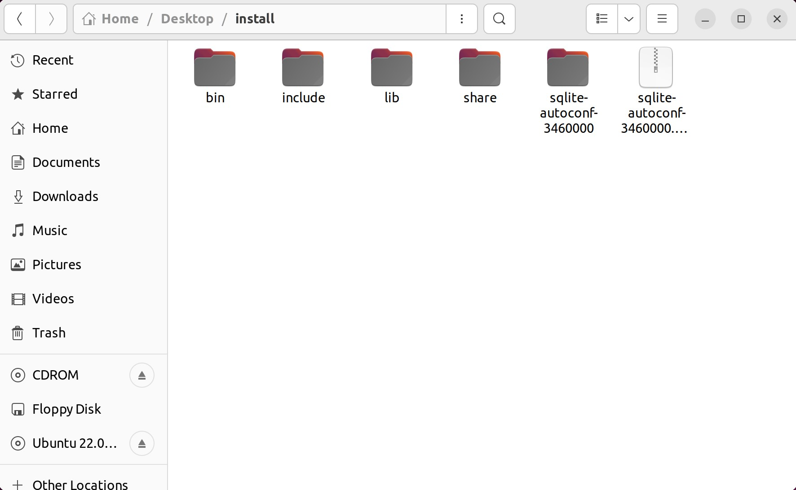

将lib目录下的库文件拷贝到开发板的/lib/目录下，将bin目录下的sqlite3拷贝到开发板的/bin/目录下，即可在开发板上使用sqlite数据库。

2. 编译client端

从github上下载下来上传的库代码，使用`gcc client.c -o client`即可进行编译，通过`./client`运行编译好的程序。

3. 交叉编译server端

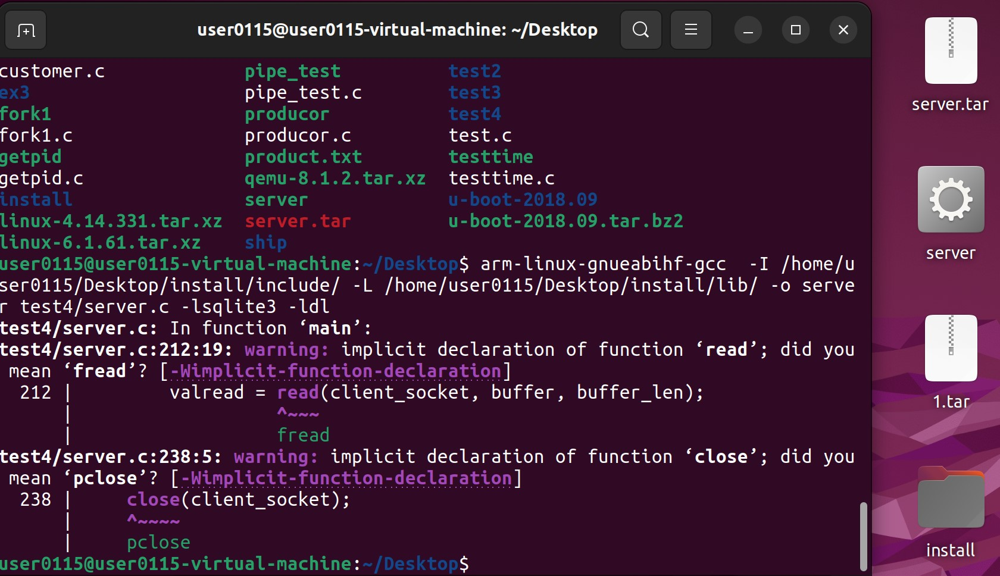

通过 `arm-linux-gnueabihf-gcc  -I /home/user0115/Desktop/install/include/ -L
/home/user0115/Desktop/install/lib/ -o server test4/server.c -lsqlite3 -ldl` 这段命令进行交叉编译，编译出可在开发板运行的可与数据库交互的程序。

4. 调试

如果需要通过网线连接（以太网），则需要在虚拟机设置中修改网络适配器的模式变成“桥接模式”。然后修改虚拟机中ipv4的地址，使两个虚拟机的ipv4地址的前三段相同，这样才能保证ping通。还需要在windows系统设置中修改”WLAN属性”为“共享”。

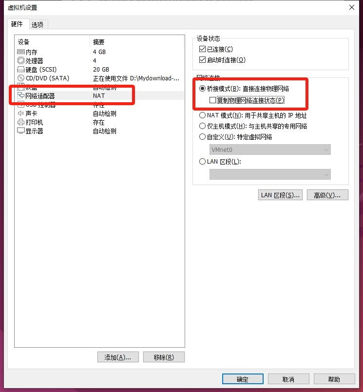


5. 运行

通过U盘拷贝到开发板后，通过./server运行。

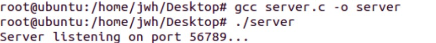

七、程序运行结果截图及性能分析

1. 客户端、服务器端的运行结果

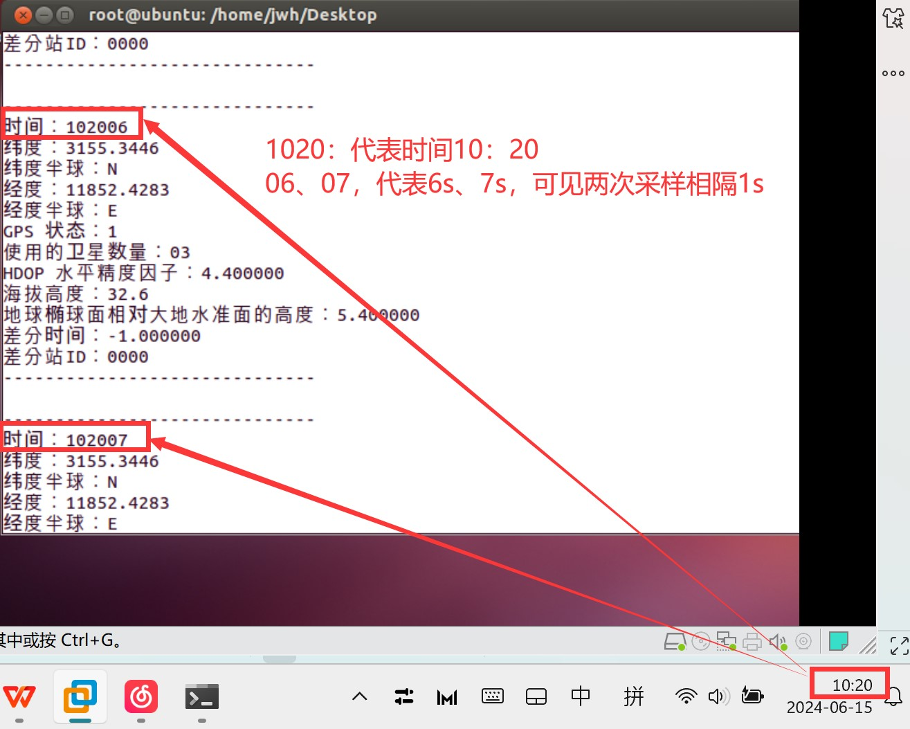

2. 数据存储

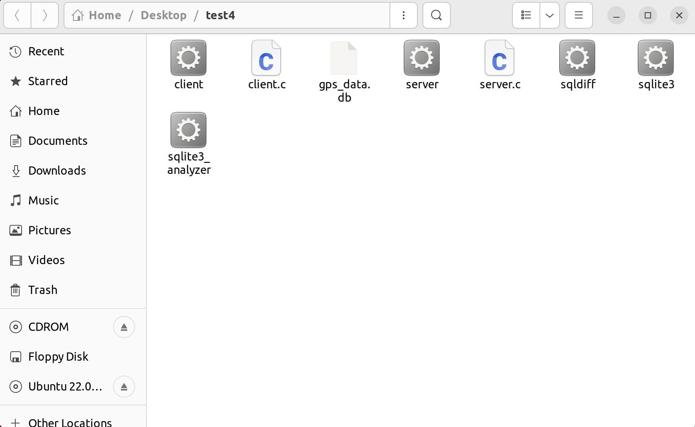

服务端接收到信息并解析后，解析数据存入sqlite数据库中，文件内容如下图所示：

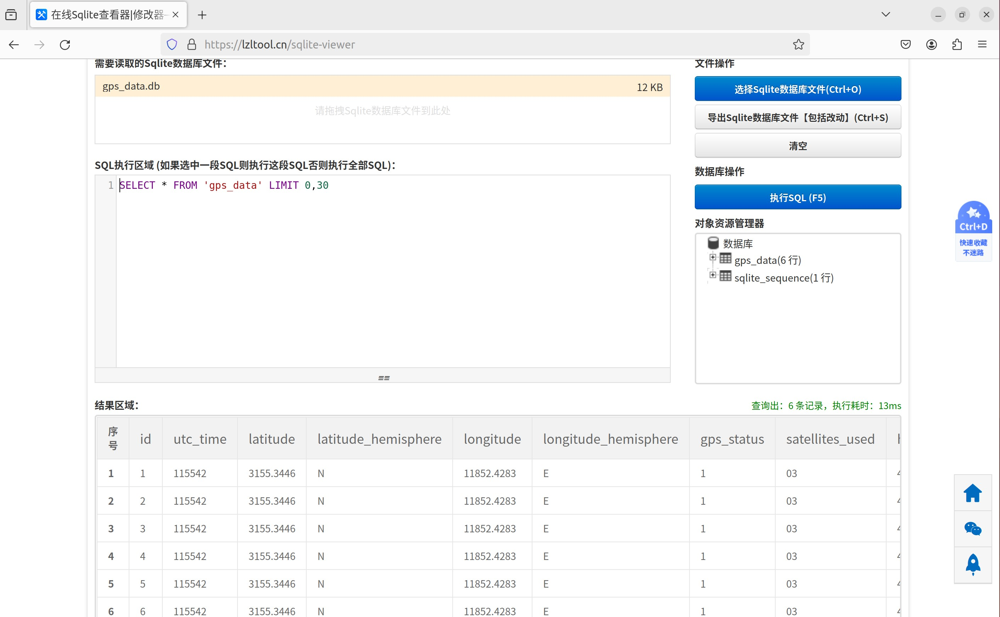

3. github使用

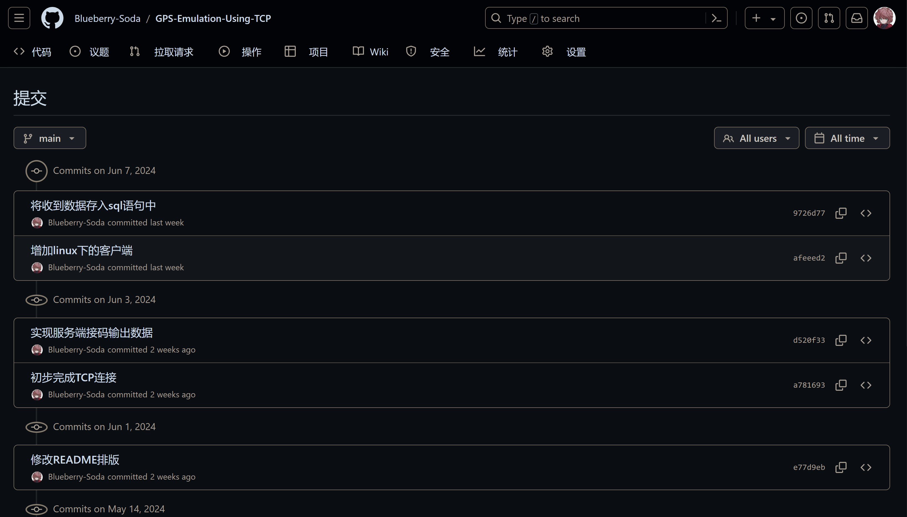

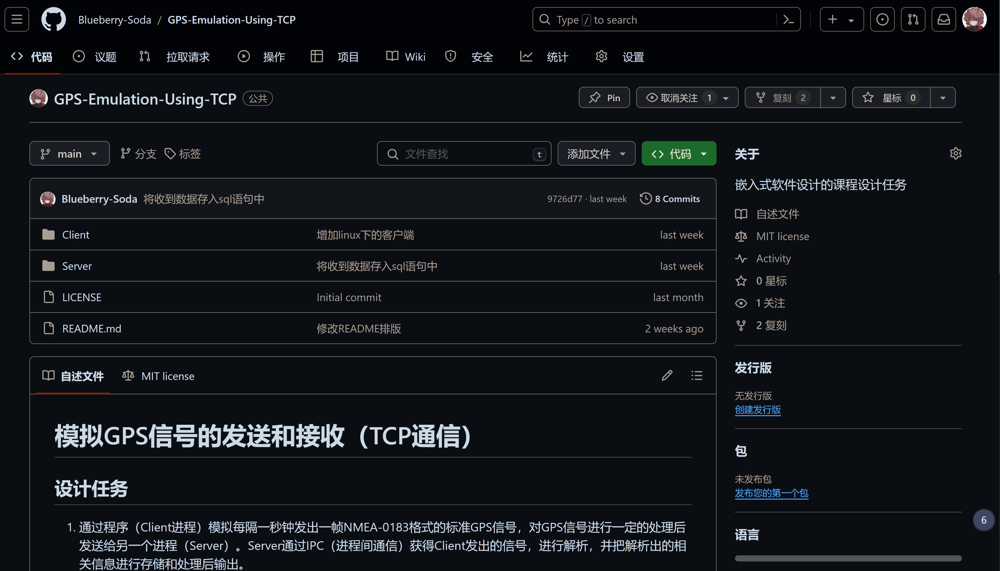

4. git的使用

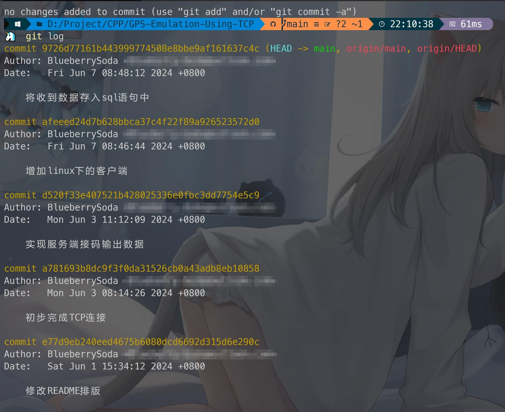

## 八、课程设计的收获和体会

在这次课程设计中，我收获了许多宝贵的经验和深刻的体会。

首先，我深入学习了关于TCP通信的知识，将计算机网络的知识融会贯通运用到实践中。TCP作为一种可靠的传输协议，在数据传输过程中发挥了关键作用。在这次设计中，我全面了解了TCP连接的建立、数据的发送与接收、连接的终止等过程，并通过编程实践这些功能，增强了对TCP协议的理解，为未来编程中使用TCP协议奠定了坚实的基础。

其次，这次课程设计提升了我的团队协作和解决问题的能力。通过使用git项目管理工具和github、gitee这两个代码托管平台，我和团队成员之间能够更加方便的进行交流和对代码进行修改。

在最后，实验取得了预期的成果，但仍有改进空间。例如，模拟GPS生成代码模块仍可改进，该格式的GPS语句中，最后有两位校验和，该校验和便是用来防止传输出错的，通过各个字符进行异或可得；以及数据库连接，由于交叉编译导致依赖的glib库版本比开发板上的高，因此无法使用，需要进行静态编译或者升级开发板的glib库版本，这样会导致体积增大、更加麻烦；整合windows客户端和linux客户端的代码，在本次实验中，我们实现了windows和linux上的客户端代码，但两者代码由于依赖库的不同是分开的，可以通过预编译的方法进行整合。

## 九、参考文献（含网络资源）

[1]  C语言、嵌入式应用：TCP通信实践[EB/OL].[2020-06-29].https://www.cnblogs.com/zhengnian/p/13206311.html.

[2]  Sqlite3移植和使用-移植到ARM开发板上[EB/OL].[2020-09-18]. https://www.cnblogs.com/liyue3/p/13690229.html.
